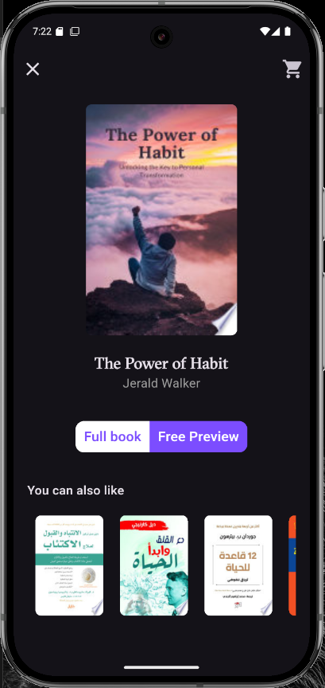

# Biblio Go 📚

A beautiful Flutter app for reading books online with an intuitive user interface and smart category management.

## Features ✨

- **📖 Online Book Reading**: Access full books or free previews
- **🎨 Beautiful UI**: Clean and modern interface for an enhanced reading experience
- **🌙 Theme Customization**: Switch between different themes to suit your preference
- **🔍 Smart Search**: Search for any book with persistent category storage
- **🧠 Intelligent Category Management**: Remembers your preferences across app sessions
- **⚡ Fast Performance**: Built with efficient state management using Cubit

## Screenshots 📱

|  Splash Screen | Category Selection |
|:---:|:---:|
|  |  |

| Book Page | search view |
|:---:|:---:|
|  |  |

| Dark Theme | search view |
|:---:|:---:|
|  |  |


## Architecture 🏗️

This app follows the **MVVM (Model-View-ViewModel)** architecture pattern with:

- **State Management**: Cubit (part of the Bloc library)
- **API Integration**: Google Books API
- **Local Storage**: Persistent category preferences

## Getting Started 🚀

### Prerequisites

- Flutter SDK (3.0.0 or higher)
- Dart SDK (2.17.0 or higher)
- Android Studio / VS Code
- Git

### Installation

1. **Clone the repository**
   ```bash
   git clone https://github.com/Aziz-Habbassi/BiblioGo.git
   cd biblio-go
   ```

2. **Install dependencies**
   ```bash
   flutter pub get
   ```

3. **Run the app**
   ```bash
   flutter run
   ```

## API Setup 🔧

This app uses the Google Books API. To set it up:

1. Go to the [Google Cloud Console](https://console.cloud.google.com/)
2. Create a new project or select an existing one
3. Enable the Google Books API
4. Create credentials (API Key)
5. Add your API key to the project configuration

## Key Features Explained 🎯

### Smart Category Management
- **First Launch**: Users select their preferred book category
- **Search Persistence**: When users search for books, the app remembers their preference
- **Session Memory**: The app opens with the last searched category, eliminating repeated category selection

### State Management with Cubit
- Efficient state management using Cubit
- Reactive UI updates
- Clean separation of business logic and presentation

### Theme Support
- Multiple theme options
- Persistent theme selection
- Smooth theme transitions

## Dependencies 📦

Key packages used in this project:

```yaml
dependencies:
  flutter:
    sdk: flutter
  flutter_bloc: ^8.1.3
  http: ^1.1.0
  shared_preferences: ^2.2.2
  # Add other dependencies as needed
```

## Usage 📝

1. **Launch**: App starts with a splash screen
2. **Category Selection**: Choose your preferred book category (first time only)
3. **Browse Books**: View books with beautiful UI
4. **Search**: Use the search icon to find specific books
5. **Theme**: Change themes from the settings
6. **Read**: Access full books or free previews

## Contributing 🤝

We welcome contributions! Please feel free to submit a Pull Request. For major changes, please open an issue first to discuss what you would like to change.

### Development Guidelines

1. Follow the existing code style
2. Write meaningful commit messages
3. Test your changes thoroughly
4. Update documentation as needed

## Roadmap 🗺️

- [ ] Offline reading support
- [ ] Book bookmarking
- [ ] Reading progress tracking
- [ ] Social features (reviews, ratings)
- [ ] Enhanced search filters
- [ ] Multiple language support

## Acknowledgments 🙏

- Google Books API for providing the book data
- Flutter team for the amazing framework
- The open-source community for inspiration and support

---

**Made with ❤️ using Flutter**

*Don't forget to star ⭐ the repository if you found it helpful!*